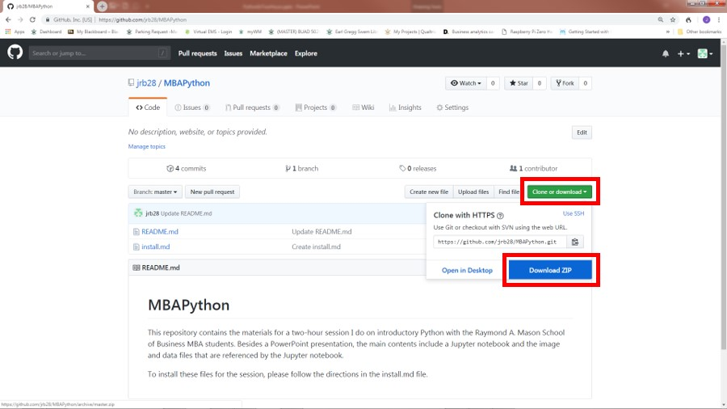
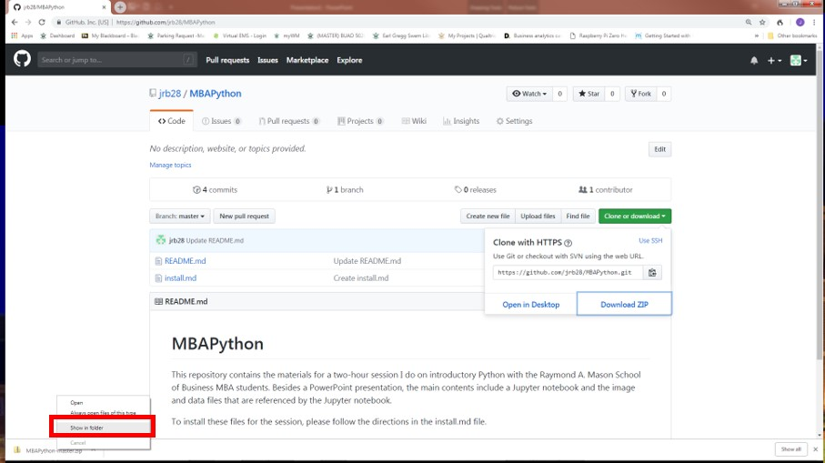
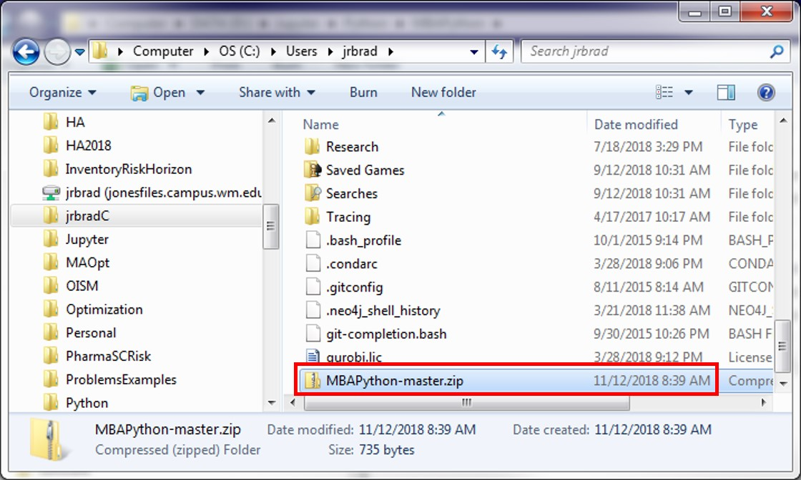
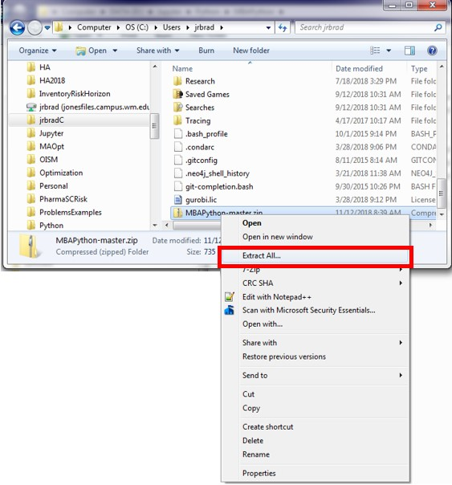
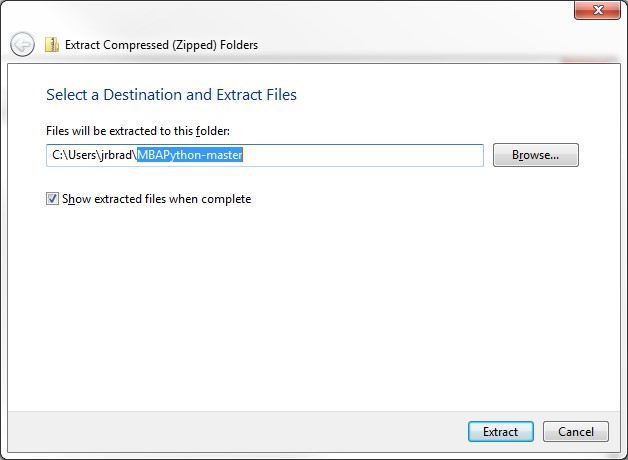
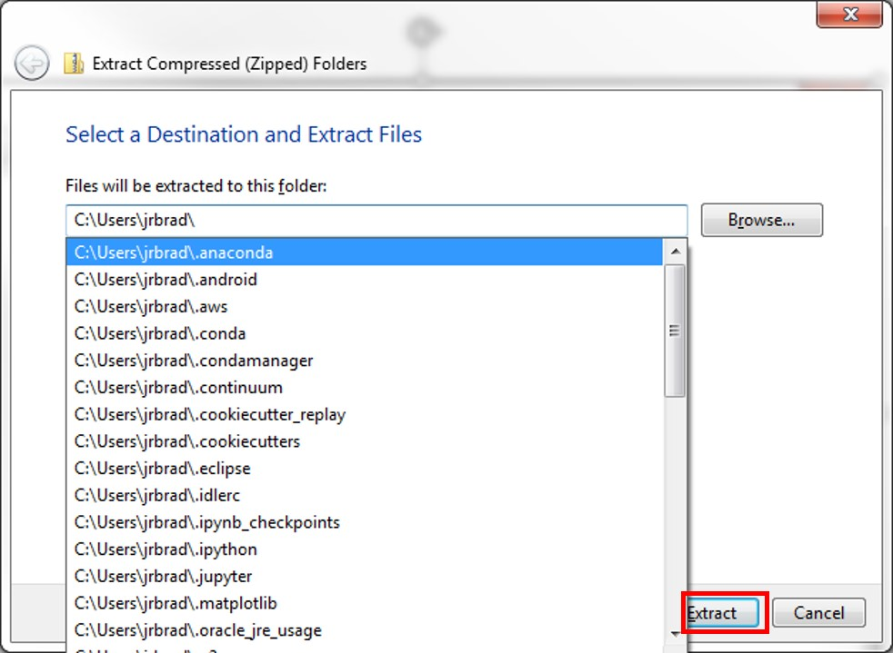
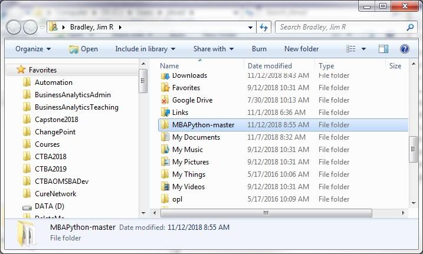

# Installation Intructions

Follow these instructions to install the Jupyter files in the correct file folder.  These directions assume that the Jupyter uses the default folder that is configured upon initial installation of Jupyter, which is your user folder.

## Installation Steps
- Left-click on "Clone or Download", and then left-click on "Download ZIP".

- Notice download tile (Chrome explorer is shown).  Right-click on tile and left-click on "Show in Folder".

- Move the file named MBAPython-master.zip to your user folder, which is typically _C:\Users\your_username_, where _your_username_ is your user name.

- Once moved, right-click on the file and left-click on "Extract All".

- Delete the last portion of the default save lcoation and save the zip contents to _C:\Users\your_username_ by left-clicking on "Extract".

- The folder with teh session contents, _MBAPython-master_, will be in your user folder when you finish.

